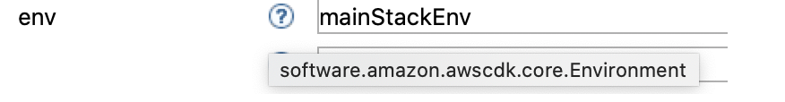

# AWS Workbench Properties Editor

The properties editor define the characteristics of the AWS Service. 

For example a stack defined by properties as below 


would generate the following code. 

```java
java.util.Map<java.lang.String, java.lang.String> mainStack_tags = new java.util.HashMap<java.lang.String, java.lang.String>();

		mainStack_tags.put("name", "demoStack");
		mainStack_tags.put("env", "primary");
		mainStack_tags.put("region", "us-east-1");

		mainStack = software.amazon.awscdk.core.Stack.Builder.create(app1, "MAINSTACK")
				.description("A Demo stack for ArchOps Demo").env(mainStackEnv).stackName("mainStack")
				.tags(mainStack_tags).terminationProtection(true).build();

```

***Understanding properties editor is critical to use this tool effectively.***


Properties of AWS Services are modelled based on [Builder pattern](https://en.wikipedia.org/wiki/Builder_pattern) . 

For example this is the [Builder](https://docs.aws.amazon.com/cdk/api/latest/java/software/amazon/awscdk/core/Stack.Builder.html) for ```Stack```. The names of the methods in the Builder become the property names in the Property editor. 


1. **Mandatory properties**: 

    - For ***App*** object, ```projectName```, ```packageName```, ```mainClassName```, ```varName``` and ```identifier``` are mandatory properties.
    - For ***Block*** and ***Sub Block***, ```label``` is mandatory.
    - For ***Stack*** and all other ***AWS Service Components***, ```varName``` and ```identifier``` are mandatory properties.

2. **Property types**:
    - Properties can be of type ```String```, ```Number```,```Boolean```,```Enum```,```Reference```,```List``` and ```Map``` 
    - To know the expected value for the property, hover on the ```?``` next to the property name. The information is available as a tooltip on the ```?``` symbol. 
     <!-- .element height="25%" -->
    - For ```String```, ```Number``` and ```Reference```, a **Textbox** is provided to enter the values
    
    - A ```Boolean``` is represented by **Checkbox**  . 
    
    - ```Enum``` are represented by **Radio Buttons**
    
    - For ```List``` and ```Map``` , a **List Box** is provided.
    

    Clicking ```Add value``` button pops up a dialog box prompting to enter the list or map value 

    List Item Dialog:
    

    Map Item Dialog
     


