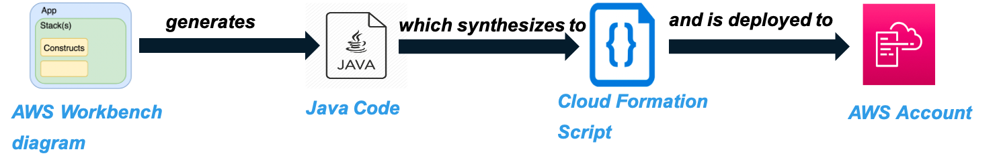
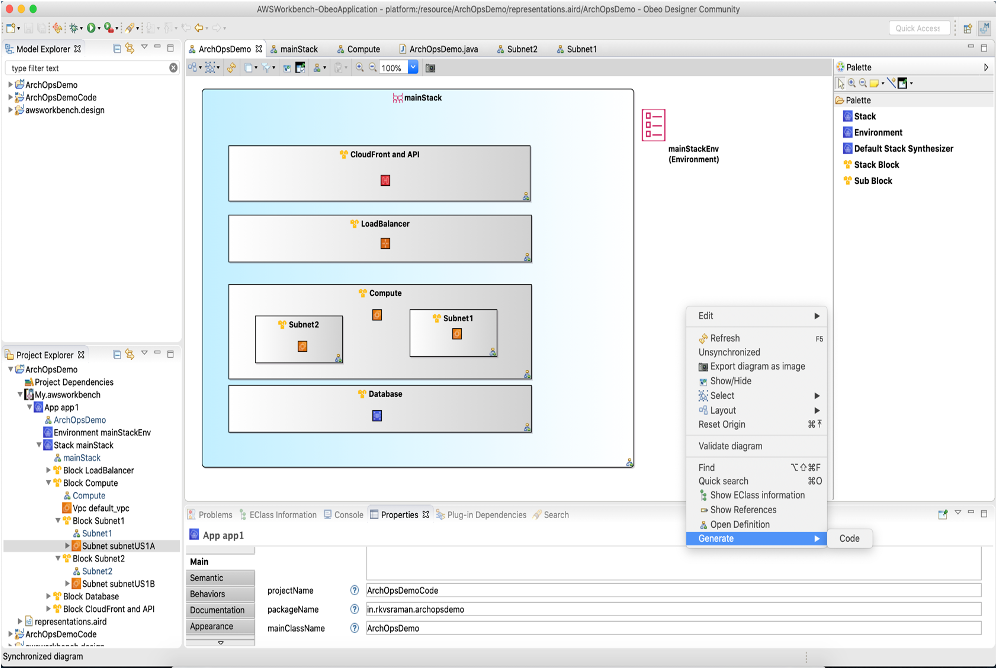
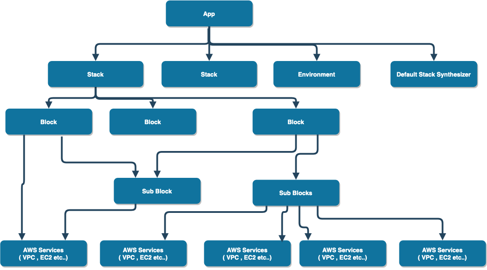

# Understanding AWS Workbench 

AWS Workbench is based on [AWS CDK](https://aws.amazon.com/cdk/) and [Eclipse Sirius](https://www.eclipse.org/sirius/). The workbench offers an Eclipse based [IDE](https://en.wikipedia.org/wiki/Integrated_development_environment) for designing and deploying AWS Services. 


Users of this workbench are typically AWS Solution Architects or Engineers. The workbench makes it easy for the users to define the AWS infrastructure using simply dropping the required AWS services on a canvas. Each service can be configured using property editors. 

## The AWS Workbench workflow




## The User Interface

Following screenshot shows the main components of the workbench

The main components of workbench are:- 
1. The project explorer for a heirarchical view of defined services
2. Draw canvas for architectural view of the AWS services 
3. Property editor used to configure each service. 
4. Tools Palette listing all the services and aws components available in the workbench. Users can drag any component and drop it into a ```Block``` or ```Sub Block``` area.  

## The user workflow 

1. The user (an AWS architect) creates a workbench project and define


## The Diagram components



- ```App``` is the topmost component in any project. An App contains one or more ```Stack``` , ```Enviroment``` and ```DefaultStackSynthesizer``` structures. The *Environment* and *DefaultStackSynthesizer* are used to configure the *Stack* 
- Each Stack consists of one or more ```Block``` structures. Each *Block* may contain one or more ```Sub Block``` structures. 
- Each *Block* and *Sub Block* contain AWS Service components.   
    