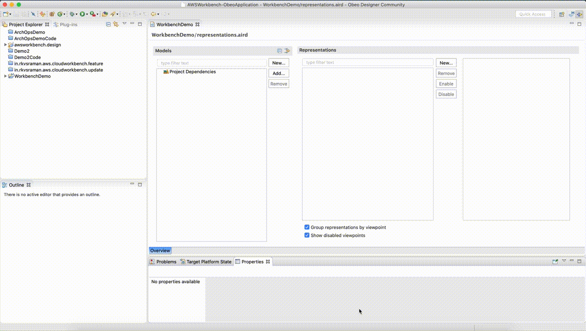

[TOCM]

# AWS Workbench getting started guide

1. Open Obeo Designer 
2. Create a new modelling project 
    - ``` Right Click on Project Explorer -> New -> Modelling Project   ```
    - Enter the name of the project.
    - Click  ```Finish```
    
3. Create a new AwsWorkbench model 
    - ```Right click on project -> New -> Other```
    - Select ```AWSWorkbench model``` from the ```Select Wizard```. Click ```Next```
    - Type the name of the awsworkbench model.  Click ```Next```
    - Select ```App Builder core``` from the dropdown list. Click ```Finish```.
     
4. Create the App Diagram. 
    - ```Expand Project Tree -> Select App null node -> Right Click App null node -> New Representation -> Other ```
    - Select ```AWS App Definition``` and click ```Finish```
    - Type a name for your diagram and click ```OK```
    
5. Understanding the AWS Workbench UI 
       
   -    


